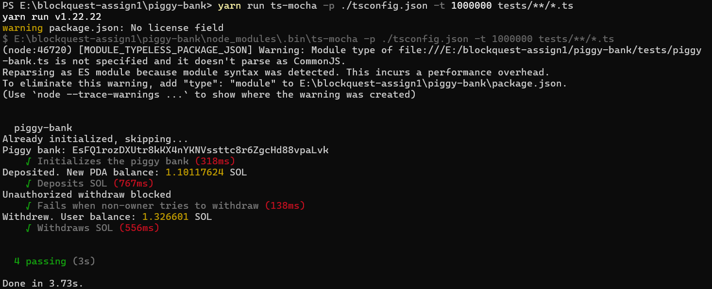
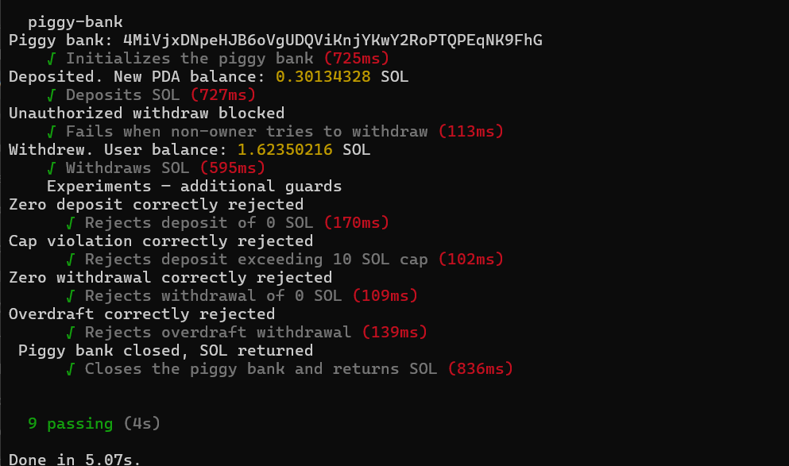

# Solana Piggy Bank - Anchor Program

A decentralized savings application built on the Solana blockchain using the Anchor framework. This program allows users to create a personal vault, deposit SOL, withdraw funds, and track their saving habits on-chain.

## Architecture

The program uses a Program Derived Address (PDA) to store the piggy bank state for each user. The address is derived using the user's public key and the seed "piggy-bank-v2".

* **Owner**: The public key of the user who initialized the bank.
* **Guards**: Logic-level constraints using require! macros to enforce business rules.
* **CPI**: Uses Cross-Program Invocations to the Solana System Program for secure SOL transfers.


## Features

* **Initialization**: Create a unique piggy bank account linked to your wallet.
* **Gated Access**: Only the owner of the piggy bank can withdraw funds.
* **Automatic Tracking**: Real-time on-chain tracking of total deposits and transaction counts.
* **Safety Limits**:
    * Zero-value transactions are rejected.
    * A 10 SOL maximum savings cap to prevent over-funding.
    * Overdraft protection ensures the account maintains rent-exempt status.
* **Account Closure**: Users can close their bank and reclaim all rent-exempt SOL.


## Program Information

* **Program ID**: DboFn63MYFp8RgeAdYezYBn89V9jtWeGhwJYWACSuD62
* **Network**: Devnet

## Testing

The project includes  comprehensive tests covering initialization, core functionality, security constraints, and account closure.

### Test Commands
You can run the tests using Anchor:
```powershell
cd piggy-bank
anchor test --skip-local-validator
```

Or run the test runner directly:
```powershell
cd piggy-bank
yarn run ts-mocha -p ./tsconfig.json -t 1000000 tests/**/*.ts
```

### Test Output



###Just to try


## Demo Video

[Watch the Project Demo](DEMO_VIDEO_LINK_PLACEHOLDER)
